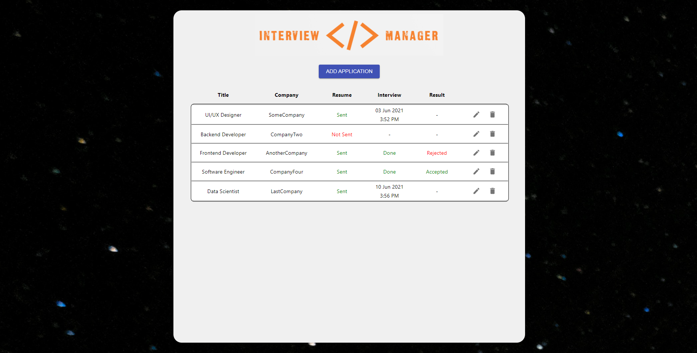

Backend for Interview Manager - a CRUD application to help users manage their job applications and interviews.

Features include:
1. Adding new application
2. Deleting application from list
3. Updating the stage of application 
4. Setting date and time of interviews
 
